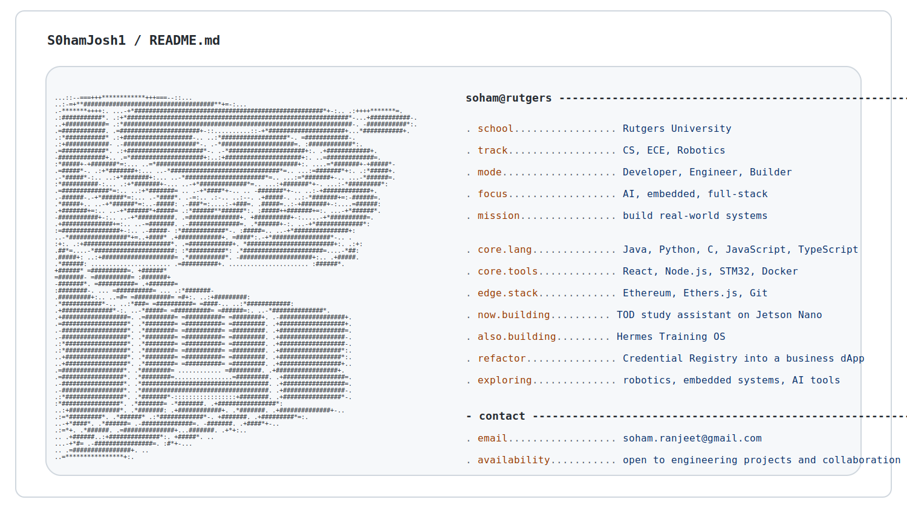

  <picture>
    <source media="(prefers-color-scheme: dark)" srcset="./assets/terminal-dark.svg">
    
  </picture>

<h1 align="center">Soham Ranjeet</h1>

  Engineering student at <strong>Rutgers University</strong> building at the intersection of robotics, embedded systems, AI, and full-stack products.

## /featured_builds

### Hermes Training OS
AI-powered running and performance training platform that combines Strava data, deterministic training logic, and adaptive performance insights.

### Decentralized Credential Registry
Credential verification system built with smart contracts, Ethereum Sepolia, IPFS storage, and a React plus Ethers.js front end.

## /current_queue

- TOD, an AI-powered study assistant using Jetson Nano workflows
- Robotics and embedded systems projects with strong hardware-software crossover
- Refactoring the credential registry into a business-facing full-stack dApp
- Expanding a portfolio of real-world engineering builds

## /toolkit

## /contact

- Email: `soham.ranjeet@gmail.com`

> Build things that actually exist in the real world.
